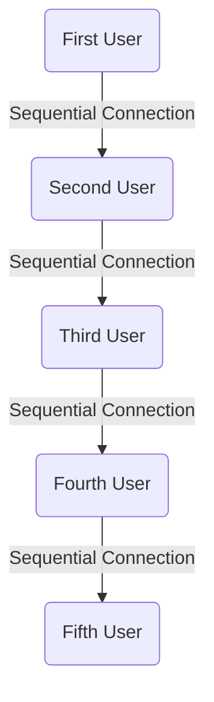

# Real-Time Multiuser Square Movement Server

This server is designed to facilitate real-time multiuser interaction by allowing users to control squares on a shared canvas. Each user is assigned a square with a unique color and can move it around the canvas. The server handles the coordination of square movements and broadcasts updates to all connected clients.

## Features

- **Real-Time Communication**: Utilizes Socket.IO to enable real-time bidirectional communication between the server and clients.
- **Multiuser Interaction**: Allows multiple users to connect simultaneously and interact with their own squares.
- **Dynamic Square Movement**: Users can move their squares around the canvas by using arrow keys, and the server broadcasts these movements to all connected clients.
- **Random Square Colors**: Assigns each user's square a random color upon connection for visual identification.

## Usage

Once the server is running, clients can connect to it to interact with the shared canvas. Clients should implement functionality to display squares and listen for socket events emitted by the server.

### Socket Events

The server emits the following socket events:

- **all_squares**: Sends the list of all squares to a new user upon connection.
- **new_square**: Notifies all connected clients when a new user joins and assigns a square to them.
- **square_moved**: Broadcasts updates to all connected clients when a user moves their square.
- **remove_square**: Notifies all connected clients when a user disconnects and removes their square.

### Square Movement

Users can move their squares around the canvas by pressing arrow keys. The server tracks square movements and broadcasts updates to ensure synchronized movement for all connected clients.

## Additional Implementation: Curved Line Connections

To enhance the visual representation of user interactions on the shared canvas, we want to implement curved line connections between squares, indicating the relationship between the last user and the next user.

### Visual Representation

We plan to use the xyflow library (https://github.com/xyflow/xyflow) to achieve this. The library provides powerful tools for building node-based UIs with React or Svelte, which will enable us to create the desired curved line connections.

### Implementation Plan

We will update the canvas rendering logic to include curved line connections between squares, connecting each square to the next square in sequence. This will provide a clear visual indication of the flow of user interactions on the canvas.

## License

This project is licensed under the [MIT License](LICENSE).

## Additional Implementation: Curved Line Connections

To enhance the visual representation of user interactions on the shared canvas, we want to implement curved line connections between squares, indicating the relationship between the last user and the next user.

Ex from a visualisation

### Implementation Plan

We plan to use the xyflow library (https://github.com/xyflow/xyflow) to achieve this. The library provides powerful tools for building node-based UIs with React or Svelte, which will enable us to create the desired curved line connections.

## License

This project is licensed under the [MIT License](LICENSE).
